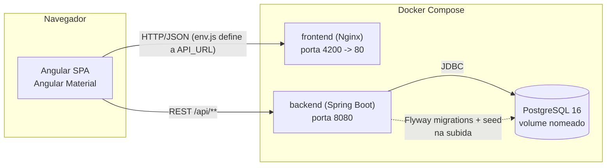
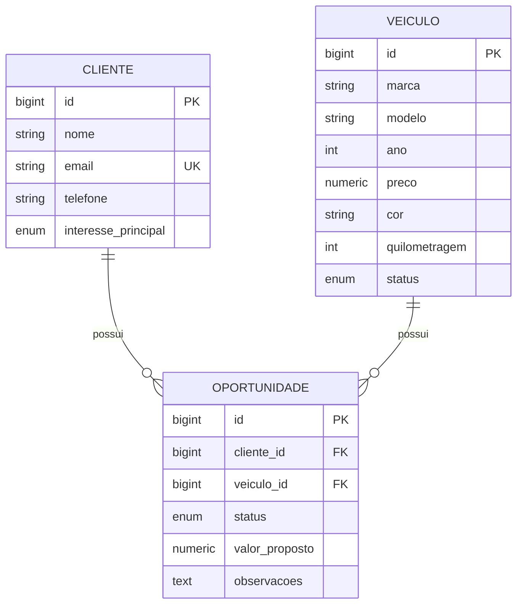

# Guia Semântico para Agentes de IA

> Este documento existe para que um agente de IA (ou uma pessoa nova no time) entenda o sistema, o domínio e as convenções do projeto **sem precisar ler todo o código antes de fazer a primeira alteração**. Se você é um agente recebendo uma tarefa neste repositório, leia este documento inteiro antes de editar qualquer arquivo.

## 1. O que este sistema é

Um CRM (Customer Relationship Management) para uma revenda de veículos. Existem três entidades de negócio centrais e um dashboard agregador:

- **Veículo**: um carro no estoque da revenda.
- **Cliente**: uma pessoa interessada em comprar um carro.
- **Oportunidade**: o vínculo entre um Cliente e um Veículo representando uma negociação de venda em andamento (ou já concluída/perdida).

Não há autenticação/login no escopo atual — é um sistema de uso interno de uma única revenda, sem multi-tenant e sem controle de usuários. Isso é uma premissa assumida (ver [NOTES.md](../NOTES.md)), não um requisito do desafio.

### Arquitetura em alto nível



O navegador do usuário fala diretamente com o backend (porta 8080 exposta no host) — o Nginx do frontend só serve os arquivos estáticos do Angular, não faz proxy de API. Ver a decisão de configuração de `API_URL` na seção 3.

## 2. Modelo de domínio e regras de negócio



### Veículo (`backend/.../veiculo`)

| Campo | Tipo | Regra |
|---|---|---|
| marca, modelo, cor | texto | obrigatórios |
| ano | inteiro | obrigatório, ≥ 1950 |
| preco | decimal | obrigatório, > 0 |
| quilometragem | inteiro | obrigatório, ≥ 0 |
| status | enum | `DISPONIVEL`, `RESERVADO`, `VENDIDO` — default `DISPONIVEL` |

**Regra de negócio importante**: o status de um veículo pode ser alterado automaticamente pelo sistema (ver Oportunidade abaixo), não apenas manualmente pelo usuário.

Um veículo **não pode ser excluído** se tiver alguma Oportunidade associada (o banco impõe isso via `ON DELETE RESTRICT` na FK; o backend traduz a violação em um erro 409 amigável — ver `VeiculoService.excluir`).

### Cliente (`backend/.../cliente`)

| Campo | Tipo | Regra |
|---|---|---|
| nome, telefone | texto | obrigatórios |
| email | texto | obrigatório, formato válido, **único** no sistema |
| interessePrincipal | enum | `SUV`, `HATCH`, `SEDAN`, `UTILITARIO`, `USADO`, `ZERO` |

O e-mail é validado como único tanto pela aplicação (`ClienteService.validarEmailDisponivel`, para dar uma mensagem de erro clara) quanto pelo banco (constraint `UNIQUE`, como rede de segurança contra condições de corrida). Um cliente **não pode ser excluído** se tiver oportunidades associadas, pelo mesmo motivo do veículo.

### Oportunidade (`backend/.../oportunidade`)

| Campo | Tipo | Regra |
|---|---|---|
| cliente, veiculo | referência | obrigatórios, devem existir |
| status | enum | `NOVO_LEAD`, `EM_NEGOCIACAO`, `PROPOSTA_ENVIADA`, `VENDIDO`, `PERDIDO` — default `NOVO_LEAD` |
| valorProposto | decimal | opcional, ≥ 0 quando informado |
| observacoes | texto livre | opcional, até 2000 caracteres |

**Regra de negócio central do sistema** (`OportunidadeService.aplicarEfeitoColateralDeVenda`): quando uma oportunidade é criada ou atualizada com status `VENDIDO`, o veículo associado é **automaticamente marcado como `VENDIDO`** no mesmo fluxo, refletindo a baixa no estoque. Essa é uma premissa de negócio assumida pelo desenvolvedor (não estava explicitada no desafio) e está documentada aqui de propósito — qualquer agente que for alterar o fluxo de oportunidades precisa saber que essa consequência existe e não deve ser removida sem uma decisão consciente. O inverso (voltar o veículo para `DISPONIVEL` se a oportunidade deixar de estar `VENDIDO`) **não** é implementado — é uma limitação conhecida, ver [NOTES.md](../NOTES.md).

Excluir uma oportunidade não tem efeitos colaterais sobre cliente/veículo.

## 3. Arquitetura

### Backend — `backend/src/main/java/com/impar/crmcarros/`

Organização por **feature/pacote de domínio** (não por camada técnica global): `veiculo/`, `cliente/`, `oportunidade/`, `dashboard/`, mais `common/` (exceções e DTOs compartilhados) e `config/` (CORS, OpenAPI).

Dentro de cada pacote de domínio, o padrão é sempre o mesmo:

```
<dominio>/
├── <Entidade>.java              # entidade JPA
├── <Entidade>Repository.java     # Spring Data JPA + JpaSpecificationExecutor
├── <Entidade>Specifications.java # specs reutilizáveis para filtros dinâmicos
├── <Entidade>Service.java        # regras de negocio, transacional
├── <Entidade>Controller.java     # REST, so orquestra request/response
├── <Entidade>Mapper.java         # conversao manual Entity <-> DTO
└── dto/
    ├── <Entidade>Request.java    # entrada (validada com Bean Validation)
    └── <Entidade>Response.java   # saida
```

Ao adicionar um novo campo ou uma nova entidade, siga exatamente esse padrão — é o que o restante do código (e os testes) espera.

Por que DTOs separados da entidade e mapeamento manual (sem MapStruct)? Para manter o projeto sem dependências extras de geração de código, dado o escopo do desafio; ficou explícito e fácil de auditar. Isso é uma escolha deliberada, não uma omissão.

**Tratamento de erros**: centralizado em `common/exception/GlobalExceptionHandler.java`. Toda exceção de negócio deve estender `BusinessRuleException` (mapeada para 409) ou usar `ResourceNotFoundException` (404). Nunca deixe uma exceção "vazar" sem handler — o objetivo é nunca expor stack trace ou detalhes internos ao cliente (requisito de segurança mínima do desafio).

**Migrations**: Flyway, arquivos versionados em `src/main/resources/db/migration`. Uma alteração de schema = um novo arquivo `V<n>__descricao.sql`. Nunca edite uma migration já aplicada — crie uma nova.

**Testes**: Mockito para os services (sem subir contexto Spring, rápido). O teste de contexto (`CrmCarrosBackendApplicationTests`) sobe o Spring Boot inteiro contra **H2 em modo PostgreSQL** (`src/test/resources/application.yml`), rodando as mesmas migrations Flyway do ambiente real — isso valida que as entidades JPA batem com o schema migrado. H2 foi escolhido para os testes automatizados não dependerem de Docker/Postgres rodando; é uma aproximação, não uma garantia 100% idêntica ao Postgres real (ver limitações no QA_GUIDE).

### Frontend — `frontend/src/app/`

```
app/
├── core/
│   ├── models/        # interfaces TS espelhando os DTOs do backend
│   ├── services/       # um HttpClient service por entidade + dashboard + runtime config + notification
│   └── interceptors/    # error.interceptor.ts: toda falha HTTP vira um snackbar de erro
├── shared/
│   ├── components/confirm-dialog/  # dialogo de confirmacao generico, usado antes de qualquer exclusao
│   └── utils/labels.ts              # mapas enum -> label em portugues e enum -> classe CSS de cor
└── features/
    ├── dashboard/
    ├── veiculos/{veiculo-list,veiculo-form,veiculo-detail-dialog}/
    ├── clientes/{cliente-list,cliente-form,cliente-detail-dialog}/
    └── oportunidades/{oportunidade-list,oportunidade-form,oportunidade-detail-dialog}/
```

Padrão de feature: `standalone components`, roteamento lazy-loaded (`app.routes.ts`), Reactive Forms, Angular Material. Toda listagem tem: filtro + paginação (`MatPaginator`) + tabela (`MatTable`) + ação de visualizar (abre `*-detail-dialog` em `MatDialog`) + editar (navega para `*-form`) + excluir (abre `ConfirmDialog` antes).

**Por que os detalhes ficam em modal e não em rota própria?** O desafio permite explicitamente essa abordagem ("pode ser feita em uma tela específica, modal, drawer..."); modal foi escolhido para reduzir a quantidade de rotas e manter o usuário no contexto da listagem.

**Configuração de API em runtime**: o frontend é buildado uma única vez e a URL da API é injetada em runtime via `frontend/public/env.js` (dev) ou gerado dinamicamente pelo entrypoint do container Nginx a partir da variável `API_URL` (produção/Docker) — ver `frontend/docker/docker-entrypoint.sh`. Nunca hardcode a URL da API em um service; sempre use `RuntimeConfigService`.

**Locale**: a aplicação inteira usa `LOCALE_ID = 'pt-BR'` (registrado em `app.config.ts`), então os pipes `currency`/`number`/`date` já formatam em português/BRL por padrão sem precisar passar locale manualmente em cada uso.

**Limitação de tipagem conhecida**: nas tabelas (`MatTable`), o parâmetro de `*matCellDef="let row"` não é inferido como o tipo genérico da linha nesta versão do Angular Material (fica `any`), então indexar um `Record<Enum, string>` diretamente no template causa erro de compilação (`TS7053`). A solução adotada em todo o projeto é expor métodos tipados no componente (`statusLabel(status)`, `statusClass(status)`) e chamá-los do template em vez de indexar o Record diretamente. Siga esse padrão em qualquer tabela nova.

## 4. Como estender o sistema

**Adicionar um campo a uma entidade existente** (ex.: adicionar "placa" ao Veículo):
1. Nova migration `V3__add_placa_veiculo.sql` no backend.
2. Adicionar o campo em `Veiculo.java`, `VeiculoRequest.java`, `VeiculoResponse.java`, `VeiculoMapper.java`.
3. Adicionar o campo em `veiculo.model.ts` (`Veiculo` e `VeiculoRequest`).
4. Adicionar o campo no formulário (`veiculo-form.ts`/`.html`) e, se fizer sentido, na listagem e no dialog de detalhes.
5. Atualizar/adicionar testes de service (backend) e de formulário (frontend).

**Adicionar uma nova entidade**: replicar a estrutura de pacotes descrita na seção 3 (backend e frontend), adicionar a rota lazy em `app.routes.ts`, adicionar o link no menu (`app.ts`/`app.html`), e uma migration para a tabela nova.

**Adicionar uma nova regra de negócio com efeito colateral entre entidades** (como a de Oportunidade → Veículo): implemente no `Service` da entidade "gatilho", nunca no controller, e documente a regra tanto em um comentário no código quanto neste arquivo (seção 2) — regras de negócio implícitas são a maior fonte de bugs de regressão em CRMs.

## 5. Premissas assumidas

Ver a lista completa e o racional em [NOTES.md](../NOTES.md). As mais relevantes para quem for mexer no código:

- Sem autenticação/autorização (fora do escopo mínimo do desafio).
- Um veículo pode ter várias oportunidades ao longo do tempo (histórico de negociações), mesmo depois de vendido — o sistema não impede criar uma nova oportunidade para um veículo já `VENDIDO`; isso é intencional (ex.: renegociação), mas fica registrado aqui para não ser "corrigido" por engano.
- Preços e valores em Real (BRL), sem suporte a outras moedas.
