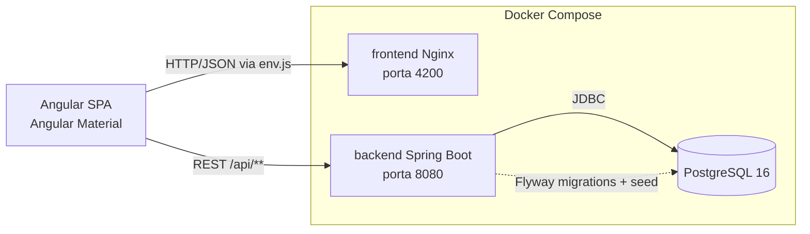
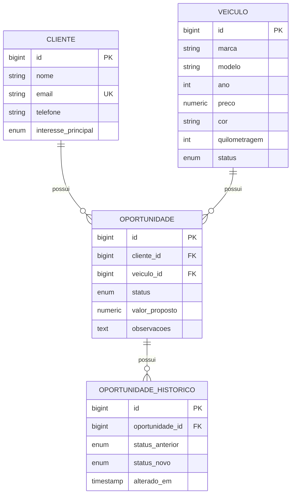

# Guia Semântico para Agentes de IA

> Este documento existe para que um agente de IA (ou uma pessoa nova no time) entenda o sistema, o domínio e as convenções do projeto **sem precisar ler todo o código antes de fazer a primeira alteração**. Se você é um agente recebendo uma tarefa neste repositório, leia este documento inteiro antes de editar qualquer arquivo.

## 1. O que este sistema é

**Chave na Mão** é um CRM (Customer Relationship Management) para uma revenda de veículos. Existem três entidades de negócio centrais e um dashboard agregador:

- **Veículo**: um carro no estoque da revenda.
- **Cliente**: uma pessoa interessada em comprar um carro.
- **Oportunidade**: o vínculo entre um Cliente e um Veículo representando uma negociação de venda em andamento (ou já concluída/perdida).

Não há autenticação/login no escopo atual — é um sistema de uso interno de uma única revenda, sem multi-tenant e sem controle de usuários. Isso é uma premissa assumida (ver [NOTES.md](../NOTES.md)), não um requisito do desafio.

### Arquitetura em alto nível



O navegador do usuário fala diretamente com o backend (porta 8080 exposta no host) — o Nginx do frontend só serve os arquivos estáticos do Angular, não faz proxy de API. Ver a decisão de configuração de `API_URL` na seção 3.

## 2. Modelo de domínio e regras de negócio



### Veículo (`backend/.../veiculo`)

| Campo | Tipo | Regra |
|---|---|---|
| marca, modelo, cor | texto | obrigatórios |
| ano | inteiro | obrigatório, ≥ 1950 |
| preco | decimal | obrigatório, > 0 |
| quilometragem | inteiro | obrigatório, ≥ 0 |
| status | enum | `DISPONIVEL`, `RESERVADO`, `VENDIDO` — default `DISPONIVEL` |

**Regra de negócio importante**: o status de um veículo pode ser alterado automaticamente pelo sistema (ver Oportunidade abaixo), não apenas manualmente pelo usuário.

Um veículo **não pode ser excluído** se tiver alguma Oportunidade associada (o banco impõe isso via `ON DELETE RESTRICT` na FK; o backend traduz a violação em um erro 409 amigável — ver `VeiculoService.excluir`).

Além do CRUD, existem 3 endpoints de apoio à UX do formulário (`GET /api/veiculos/marcas`, `GET /api/veiculos/modelos?marca=X`, `GET /api/veiculos/cores`) que retornam os valores distintos já cadastrados, usados para alimentar autocomplete no frontend (marca → filtra modelo em cascata). Eles não impõem uma lista fechada — o campo continua aceitando texto livre, é só uma sugestão a partir do que já existe no banco.

### Cliente (`backend/.../cliente`)

| Campo | Tipo | Regra |
|---|---|---|
| nome, telefone | texto | obrigatórios |
| email | texto | obrigatório, formato válido, **único** no sistema |
| interessePrincipal | enum | `SUV`, `HATCH`, `SEDAN`, `UTILITARIO`, `USADO`, `ZERO` |

O e-mail é validado como único tanto pela aplicação (`ClienteService.validarEmailDisponivel`, para dar uma mensagem de erro clara) quanto pelo banco (constraint `UNIQUE`, como rede de segurança contra condições de corrida). Um cliente **não pode ser excluído** se tiver oportunidades associadas, pelo mesmo motivo do veículo.

### Oportunidade (`backend/.../oportunidade`)

| Campo | Tipo | Regra |
|---|---|---|
| cliente, veiculo | referência | obrigatórios, devem existir |
| status | enum | `NOVO_LEAD`, `EM_NEGOCIACAO`, `PROPOSTA_ENVIADA`, `VENDIDO`, `PERDIDO` — default `NOVO_LEAD` |
| valorProposto | decimal | opcional, ≥ 0 quando informado |
| observacoes | texto livre | opcional, até 2000 caracteres |

**Regra de negócio central do sistema** (`OportunidadeService.aplicarEfeitoColateralDeVenda`): quando uma oportunidade é criada ou atualizada com status `VENDIDO`, o veículo associado é **automaticamente marcado como `VENDIDO`** no mesmo fluxo, refletindo a baixa no estoque. Essa é uma premissa de negócio assumida pelo desenvolvedor (não estava explicitada no desafio) e está documentada aqui de propósito — qualquer agente que for alterar o fluxo de oportunidades precisa saber que essa consequência existe e não deve ser removida sem uma decisão consciente. O inverso (voltar o veículo para `DISPONIVEL` se a oportunidade deixar de estar `VENDIDO`) **não** é implementado — é uma limitação conhecida, ver [NOTES.md](../NOTES.md).

**`RESERVADO` não tem a mesma automação**: só existe a regra acima (oportunidade `VENDIDO` → veículo `VENDIDO`), unidirecional. Não há nenhuma regra ligando o status de uma oportunidade a um veículo ficar `RESERVADO` — esse status é sempre definido manualmente no formulário do veículo (o campo Status oferece os 3 valores livremente, inclusive `VENDIDO` direto, sem depender de oportunidade). Um veículo `RESERVADO` sem nenhuma oportunidade vinculada é um estado válido do sistema — a seção "Clientes interessados" da tela de detalhe (`veiculo-detail`) fica vazia nesse caso de propósito, não é um bug. Ver [NOTES.md](../NOTES.md) para o raciocínio completo por trás dessa assimetria.

Excluir uma oportunidade não tem efeitos colaterais sobre cliente/veículo (mas exclui em cascata o próprio histórico dela, via `ON DELETE CASCADE`).

### Histórico de status da oportunidade (`OportunidadeHistorico`)

Toda vez que uma oportunidade é criada, ou tem seu `status` alterado numa edição, uma entrada é gravada em `oportunidade_historico` (`status_anterior` nulo na criação, preenchido nas mudanças seguintes). É uma auditoria enxuta e deliberadamente escopada só ao status da oportunidade (o funil de vendas) — não é um audit log genérico de todos os campos de todas as entidades, o que seria escopo desproporcional ao pedido do desafio. Exposto via `GET /api/oportunidades/{id}/historico`, consumido pela timeline na tela de detalhe da oportunidade no frontend. Ver `OportunidadeService.registrarHistorico`.

## 3. Arquitetura

### Backend — `backend/src/main/java/com/impar/crmcarros/`

Organização por **feature/pacote de domínio** (não por camada técnica global): `veiculo/`, `cliente/`, `oportunidade/`, `dashboard/`, mais `common/` (exceções e DTOs compartilhados) e `config/` (CORS, OpenAPI).

Dentro de cada pacote de domínio, o padrão é sempre o mesmo:

```
<dominio>/
├── <Entidade>.java              # entidade JPA
├── <Entidade>Repository.java     # Spring Data JPA + JpaSpecificationExecutor
├── <Entidade>Specifications.java # specs reutilizáveis para filtros dinâmicos
├── <Entidade>Service.java        # regras de negocio, transacional
├── <Entidade>Controller.java     # REST, so orquestra request/response
├── <Entidade>Mapper.java         # conversao manual Entity <-> DTO
└── dto/
    ├── <Entidade>Request.java    # entrada (validada com Bean Validation)
    └── <Entidade>Response.java   # saida
```

Ao adicionar um novo campo ou uma nova entidade, siga exatamente esse padrão — é o que o restante do código (e os testes) espera.

Por que DTOs separados da entidade e mapeamento manual (sem MapStruct)? Para manter o projeto sem dependências extras de geração de código, dado o escopo do desafio; ficou explícito e fácil de auditar. Isso é uma escolha deliberada, não uma omissão.

**Tratamento de erros**: centralizado em `common/exception/GlobalExceptionHandler.java`. Toda exceção de negócio deve estender `BusinessRuleException` (mapeada para 409) ou usar `ResourceNotFoundException` (404). Erros de tipo/formato de parâmetro (`MethodArgumentTypeMismatchException`, `HttpMessageNotReadableException`) viram 400, nunca 500 — um id não numérico na URL, por exemplo, é erro do cliente, não do servidor. Nunca deixe uma exceção "vazar" sem handler — o objetivo é nunca expor stack trace ou detalhes internos ao cliente (requisito de segurança mínima do desafio), mas todo erro 5xx é logado no servidor (`log.error`) antes de responder, para não perder rastreabilidade.

**Segurança HTTP**: `config/SecurityHeadersFilter.java` adiciona `X-Content-Type-Options`, `X-Frame-Options` e `Referrer-Policy` em toda resposta da API (o Nginx do frontend faz o mesmo para os arquivos estáticos, em `frontend/docker/nginx.conf`). Se adicionar Spring Security no futuro, esses headers passam a ser responsabilidade dele — remova o filtro manual para não duplicar.

**Migrations**: Flyway, arquivos versionados em `src/main/resources/db/migration`. Uma alteração de schema = um novo arquivo `V<n>__descricao.sql`. Nunca edite uma migration já aplicada — crie uma nova.

**Testes**: Mockito para os services (sem subir contexto Spring, rápido). O teste de contexto (`CrmCarrosBackendApplicationTests`) sobe o Spring Boot inteiro contra **H2 em modo PostgreSQL** (`src/test/resources/application.yml`), rodando as mesmas migrations Flyway do ambiente real — isso valida que as entidades JPA batem com o schema migrado. H2 foi escolhido para os testes automatizados não dependerem de Docker/Postgres rodando; é uma aproximação, não uma garantia 100% idêntica ao Postgres real. Para fechar essa lacuna, existe também `CrmCarrosPostgresIntegrationTest`, que sobe um PostgreSQL real via **Testcontainers** e roda/passa de verdade no CI (confirmado, `docs/TEST_EXECUTION_LOG.md` seção 5.6). Ele pula a si mesmo de forma limpa (`Assumptions`) se o Docker não estiver acessível ao Testcontainers no ambiente (aconteceu de verdade em uma máquina de desenvolvimento com Docker Desktop muito recente; ver seção 5.2), então não trate um "0 tests run" nessa classe como falha — confira se é um skip por indisponibilidade de Docker antes de investigar mais.

### Frontend — `frontend/src/app/`

```
app/
├── core/
│   ├── models/        # interfaces TS espelhando os DTOs do backend
│   ├── services/       # um HttpClient service por entidade + dashboard + runtime config + notification
│   └── interceptors/    # error.interceptor.ts: toda falha HTTP vira um snackbar de erro
├── shared/
│   ├── components/confirm-dialog/  # unico uso restante de MatDialog: confirmacao antes de excluir
│   └── utils/labels.ts              # mapas enum -> label em portugues e enum -> classe CSS de cor
└── features/
    ├── dashboard/
    ├── veiculos/{veiculo-list,veiculo-form,veiculo-detail}/
    ├── clientes/{cliente-list,cliente-form,cliente-detail}/
    └── oportunidades/{oportunidade-list,oportunidade-form,oportunidade-detail}/
```

Padrão de feature: `standalone components`, roteamento lazy-loaded (`app.routes.ts`), Reactive Forms, Angular Material. Toda listagem tem: filtro + paginação (`MatPaginator`) + tabela (`MatTable`) + ação de visualizar (navega para `*-detail`, uma **rota própria**, ex. `/veiculos/:id`) + editar (navega para `*-form`) + excluir (abre `ConfirmDialog` antes).

**Por que os detalhes viraram rota própria e não ficaram em modal?** O desafio permite explicitamente as duas abordagens ("pode ser feita em uma tela específica, modal, drawer..."). A primeira versão usava modal (menos rotas, mantém o contexto da listagem); depois trocada para rota própria por decisão consciente de UX/arquitetura — permite link direto para um registro, funciona com o botão voltar do navegador, e a tela de detalhe da oportunidade precisava de espaço para a timeline de histórico, que não cabia bem num modal. Ao adicionar uma nova entidade, siga o padrão de rota própria (`<entidade>-detail/`), não modal.

**Configuração de API em runtime**: o frontend é buildado uma única vez e a URL da API é injetada em runtime via `frontend/public/env.js` (dev) ou gerado dinamicamente pelo entrypoint do container Nginx a partir da variável `API_URL` (produção/Docker) — ver `frontend/docker/docker-entrypoint.sh`. Nunca hardcode a URL da API em um service; sempre use `RuntimeConfigService`.

**Identidade visual (logo/favicon)**: `frontend/public/logo.png` (512×512, PNG com transparência real) é a arte-mestre usada tanto no ícone da marca na sidenav (`.app-brand-icon` em `app.html`/`app.scss`) quanto como fonte para gerar `frontend/public/favicon.ico` (multi-resolução: 16/32/48/64px). Os dois arquivos em `public/` são servidos como estão (Angular copia `public/` para a raiz do build). Se a arte for trocada no futuro, regenere o `.ico` a partir do novo `logo.png` (não existe um passo de build automático para isso) e lembre que navegadores cacheiam favicon de forma agressiva — um refresh normal pode não mostrar o novo ícone na aba.

**Cache do Nginx e `index.html`**: `frontend/docker/nginx.conf` cacheia arquivos `.js`/`.css`/`.ico`/imagens por 7 dias (`Cache-Control: public`), o que é seguro porque o Angular já dá hash no nome desses arquivos a cada build (`main-AB12CD.js`) — um arquivo novo tem um nome novo. O `index.html`, porém, tem `Cache-Control: no-cache` explícito (bloco `location = /index.html`), porque é ele quem referencia os nomes com hash da build atual — se o navegador cachear um `index.html` antigo, ele continua carregando o JS antigo indefinidamente mesmo depois de um `docker compose up --build` novo. Qualquer novo arquivo HTML servido estaticamente pelo Nginx (não só a raiz) precisa do mesmo tratamento.

**Locale**: a aplicação inteira usa `LOCALE_ID = 'pt-BR'` (registrado em `app.config.ts`), então os pipes `currency`/`number`/`date` já formatam em português/BRL por padrão sem precisar passar locale manualmente em cada uso. O `MatPaginatorIntl` também é sobrescrito globalmente (`core/services/paginator-intl-pt-br.ts`) para traduzir os textos do paginador ("Itens por página", etc.) — qualquer tela nova com `MatPaginator` já herda a tradução automaticamente, não precisa configurar nada por componente.

**Tema claro/escuro**: `core/services/theme.service.ts` alterna uma classe `dark-theme` no `<html>`, e `styles.scss` define dois blocos `@include mat.theme(...)` (um com `theme-type: light`, outro com `theme-type: dark`) usando a mesma paleta — é assim que o Angular Material 3 troca de tema sem duplicar CSS customizado, já que todos os componentes (e os estilos globais que usam `--mat-sys-*`) reagem à troca de classe automaticamente. A preferência do usuário é persistida em `localStorage` (com fallback para `prefers-color-scheme` do sistema na primeira visita) — o acesso a `localStorage`/`window`/`document` é sempre defensivo (`typeof x !== 'undefined'`) porque o ambiente de teste (Vitest) não fornece esses globals da mesma forma que um navegador real; isso já causou uma falha de teste real, ver `docs/TEST_EXECUTION_LOG.md`.

**Campos numéricos com valor padrão `0`**: `shared/directives/select-on-focus.directive.ts` (`selectOnFocus`, aplicada em `<input>`) seleciona todo o conteúdo do campo ao ganhar foco, para que o usuário digite por cima do `0` padrão em vez de precisar apagá-lo manualmente antes. Usada nos campos `ano`, `preco` e `quilometragem` do formulário de veículo e `valorProposto` do formulário de oportunidade. Qualquer novo campo numérico com valor inicial `0` deve usar essa diretiva pelo mesmo motivo de UX.

**Ordenação de colunas (`MatSort`)**: as 3 listagens usam `matSort`/`mat-sort-header` no `<table>` e enviam `sort=<campo>,<asc|desc>` para o backend (`Pageable` do Spring Data já resolve isso nativamente via `@PageableDefault`, sem código adicional). Em `oportunidade-list`, as colunas "Cliente" e "Veículo" ordenam por propriedade aninhada (`mat-sort-header="cliente.nome"` / `"veiculo.marca"`), o que funciona porque o backend usa `JpaSpecificationExecutor.findAll(spec, pageable)` — Spring Data resolve caminhos com ponto em relações `@ManyToOne` automaticamente, sem precisar de query customizada. Em `cliente-list`, o cabeçalho "Interesse" usa `mat-sort-header="interessePrincipal"` porque o nome da coluna na tabela (`interesse`) é diferente do nome do campo na entidade.

**Filtro por status vindo de outra tela (query param)**: os cards e as linhas de status do dashboard (`features/dashboard/dashboard.html`) navegam para `/veiculos?status=X` ou `/oportunidades?status=X` via `routerLink`/`queryParams`. As listagens leem `route.snapshot.queryParamMap.get('status')` no `ngOnInit` e pré-selecionam o `FormControl` do filtro (com `emitEvent: false`, para não disparar `carregar()` duas vezes) antes da primeira carga. Qualquer novo ponto de entrada externo para uma listagem filtrada deve seguir esse mesmo padrão de query param, não introduzir um mecanismo próprio.

**Entidades relacionadas na tela de detalhe**: `cliente-detail` mostra as oportunidades daquele cliente (`oportunidadeService.listar({ clienteId })`) e `veiculo-detail` mostra os clientes interessados naquele veículo (`oportunidadeService.listar({ veiculoId })`) — o backend já suportava esses filtros (usados também pelos dropdowns de `oportunidade-list`), então isso não exigiu nenhum endpoint novo. Os dois seguem o mesmo layout de duas colunas (`.detail-layout`, grid `1.2fr 1fr` que colapsa para 1 coluna em `max-width: 900px`) já usado em `oportunidade-detail` para a timeline de histórico — reaproveite esse padrão (classes `.related-card`/`.related-list`/`.related-row`) para qualquer relação nova entre entidades.

**Padrão dos 3 formulários (`.form-card`/`.form-grid`/`.form-actions`)**: classes globais em `frontend/src/styles.scss`, compartilhadas por `veiculo-form`, `cliente-form` e `oportunidade-form` — `.form-card` é o `<mat-card>` externo (padding próprio, já que o Material não aplica padding a conteúdo solto dentro do card sem `mat-card-content`), `.form-grid` é o grid de 2 colunas dos campos (1 coluna em telas até 599px), `.form-actions` alinha os botões Cancelar/Salvar à direita. Qualquer ajuste visual nesse padrão (espaçamento, largura máxima, etc.) deve ser feito uma vez em `styles.scss`, não replicado nos 3 componentes — é assim que uma correção de espaçamento (`docs/TEST_EXECUTION_LOG.md`, seção 9.6) valeu para os 3 formulários de uma vez.

**`.table-wrapper` é um card "manual", não um `<mat-card>`**: as 3 listagens envolvem a tabela num `<div class="table-wrapper">` simples (não em `<mat-card>`, pra não precisar importar `MatCardModule` só por isso), mas a regra global em `styles.scss` replica exatamente o fundo/sombra/border-radius que o `mat-card` usa (valores lidos ao vivo via `getComputedStyle()` num card real, não aproximados). Se um dia isso virar um `<mat-card>` de verdade, a regra `.table-wrapper` fica redundante e pode ser removida. `.page-header h1` também ganhou uma barrinha de destaque com gradiente (`::after`) — aparece em toda tela que usa `.page-header` (listagens, detalhe, formulário), não só nas listagens.

**Cuidado ao sobrescrever CSS de um componente do Angular Material com Flexbox/Grid**: `<mat-card>` (MDC) já vem com `display: flex; flex-direction: column` como estilo interno padrão do próprio componente. Uma regra customizada que só define `display`/`align-items`/`justify-content` sem tocar em `flex-direction` continua "herdando" o `column` do Material silenciosamente — isso já causou um bug real de centralização no dashboard (`.stat-card` virou uma coluna, não uma linha, sem ninguém pedir), que só foi pego medindo `getBoundingClientRect()` via script, não olhando um screenshot (ver `docs/TEST_EXECUTION_LOG.md` seção 9.5). Ao sobrescrever o layout interno de um componente de terceiro, declare **todas** as propriedades flex/grid relevantes explicitamente, mesmo as que parecem redundantes — não assuma o valor inicial do CSS.

**Testes E2E**: `frontend/e2e/*.spec.ts` (Playwright), rodam contra a stack real via Docker Compose (não contra `ng serve`/mocks) — cobrem os fluxos de CRUD completo, a regra de negócio de venda, e (`ui.spec.ts`) a marca/identidade visual, a tradução do paginador, o toggle de tema claro/escuro, a ordenação de colunas e as entidades relacionadas na tela de detalhe. Ao adicionar uma tela ou fluxo novo relevante, adicione um teste E2E cobrindo o caminho feliz; ver `docs/QA_GUIDE.md` para o comando de execução.

**Cuidado ao adicionar um novo `routerLink` no dashboard (ou em qualquer lugar com nome parecido a um item da sidenav)**: `page.getByRole('link', { name: '...' })` do Playwright faz *substring match* por padrão — um card "Veículos cadastrados" e o link "Veículos" do menu lateral colidem nessa busca. Isso já quebrou 2 testes reais ao adicionar os cards clicáveis do dashboard (ver `docs/TEST_EXECUTION_LOG.md`). Ao escrever um teste que localiza um link do menu lateral, use `exact: true`.

**Pegadinha de `getByText` com regex no Playwright**: o Playwright colapsa espaços internos do texto ao comparar, mas **preserva** um espaço nas bordas quando o elemento tem espaço em branco ao redor do conteúdo (comum em componentes do Angular Material, ex. o rótulo do `MatPaginator` renderiza como `" 1 – 8 de 8 "`, com espaço antes e depois). Um regex ancorado com `^\d` ou `\d+$` sem tolerar essa borda (`\s*`) nunca casa. Sempre teste regex de matching de texto com `\s*` nas pontas quando o elemento não for garantidamente "texto puro sem padding".

**Ambiguidade de `getByLabel` em `MatAutocomplete`**: o painel de opções (`role="listbox"`) fica associado ao mesmo `aria-labelledby` do campo de input, então `page.getByLabel('Marca')` pode resolver dois elementos (o input e o painel) e falhar em modo estrito. Use `page.getByRole('combobox', { name: 'Marca' })` para apontar direto ao input.

**Registro recém-criado pode nao estar na 1ª página da listagem**: o banco tem uma massa de dados de seed relativamente grande (`V4__mais_massa_de_dados.sql`, 32 veículos/16 clientes/18 oportunidades) — um teste E2E que cria um registro e em seguida tenta localizar a linha dele na listagem (`page.getByRole('row').filter({ hasText: ... })`) sem aplicar nenhum filtro pode falhar, porque o novo registro (maior id) cai fora da página padrão do `MatPaginator`. Sempre filtre pela busca/dropdown da própria tela (ex. `page.getByRole('combobox', { name: 'Cliente' })`) antes de procurar a linha, em vez de assumir que ela está visível na primeira página.

**Limitação de tipagem conhecida**: nas tabelas (`MatTable`), o parâmetro de `*matCellDef="let row"` não é inferido como o tipo genérico da linha nesta versão do Angular Material (fica `any`), então indexar um `Record<Enum, string>` diretamente no template causa erro de compilação (`TS7053`). A solução adotada em todo o projeto é expor métodos tipados no componente (`statusLabel(status)`, `statusClass(status)`) e chamá-los do template em vez de indexar o Record diretamente. Siga esse padrão em qualquer tabela nova.

## 4. Como estender o sistema

**Adicionar um campo a uma entidade existente** (ex.: adicionar "placa" ao Veículo):
1. Nova migration `V3__add_placa_veiculo.sql` no backend.
2. Adicionar o campo em `Veiculo.java`, `VeiculoRequest.java`, `VeiculoResponse.java`, `VeiculoMapper.java`.
3. Adicionar o campo em `veiculo.model.ts` (`Veiculo` e `VeiculoRequest`).
4. Adicionar o campo no formulário (`veiculo-form.ts`/`.html`) e, se fizer sentido, na listagem e na página de detalhe (`veiculo-detail/`).
5. Atualizar/adicionar testes de service (backend) e de formulário (frontend).

**Adicionar uma nova entidade**: replicar a estrutura de pacotes descrita na seção 3 (backend e frontend), adicionar a rota lazy em `app.routes.ts`, adicionar o link no menu (`app.ts`/`app.html`), e uma migration para a tabela nova.

**Adicionar uma nova regra de negócio com efeito colateral entre entidades** (como a de Oportunidade → Veículo): implemente no `Service` da entidade "gatilho", nunca no controller, e documente a regra tanto em um comentário no código quanto neste arquivo (seção 2) — regras de negócio implícitas são a maior fonte de bugs de regressão em CRMs.

## 5. Premissas assumidas

Ver a lista completa e o racional em [NOTES.md](../NOTES.md). As mais relevantes para quem for mexer no código:

- Sem autenticação/autorização (fora do escopo mínimo do desafio; decisão consciente, ver NOTES.md).
- Um veículo pode ter várias oportunidades ao longo do tempo (histórico de negociações), mesmo depois de vendido — o sistema não impede criar uma nova oportunidade para um veículo já `VENDIDO`; isso é intencional (ex.: renegociação), mas fica registrado aqui para não ser "corrigido" por engano.
- Preços e valores em Real (BRL), sem suporte a outras moedas.
- Auditoria (histórico) escopada apenas ao status da oportunidade — não é um audit log genérico de todas as entidades/campos.
